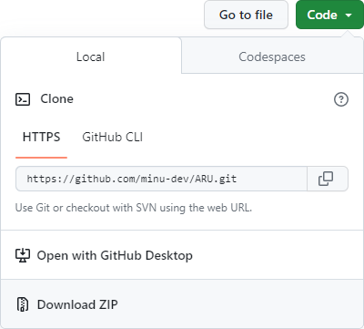
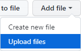
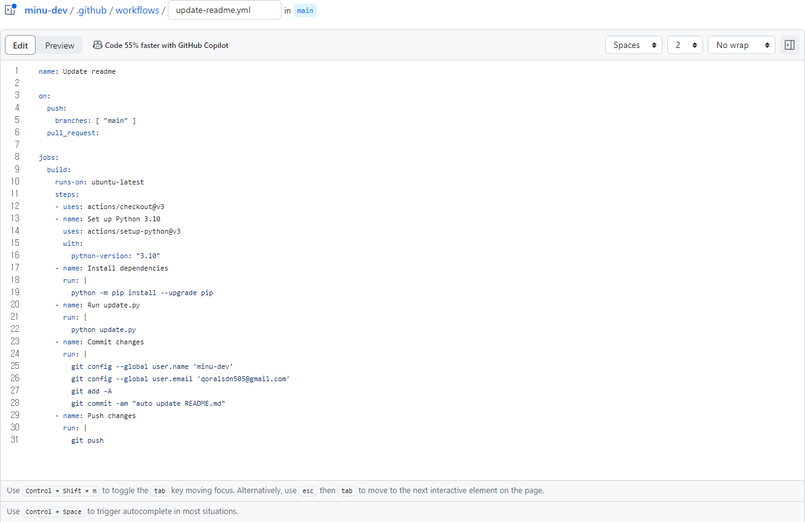
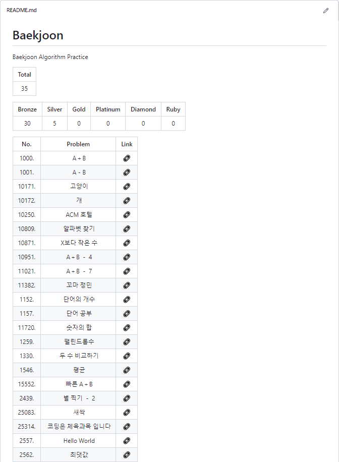

    <h1> 🛠️ ARU 📃</h1>

 
 

🔨 ARU stands for *Automatic README.md Update*. This tool is an addon for **[Baekjoon Hub](https://github.com/BaekjoonHub/BaekjoonHub)**. When a solution is committed to your GitHub through Baekjun Hub, it detects it and updates the README.md file automatically.

 

## 💾 Install

***1️. Download this repository as ZIP***
 

 

***2. Upload***  
Unzip the downloaded files and upload *update.py* file which is in the *Source* folder.
 

 

***3. Make Workflow***  
On the *Actions* tab, search *Python Package* and configure it.  
Rename the file generated as an example to *update-readme.yml* and overwrite it with the contents of the *update-readme.yml* in the downloaded *Source* folder.
 

 

***4. Done*** 😀  
Let me show you an example
 

 
